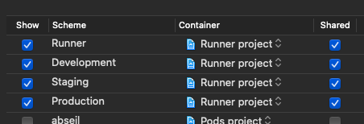
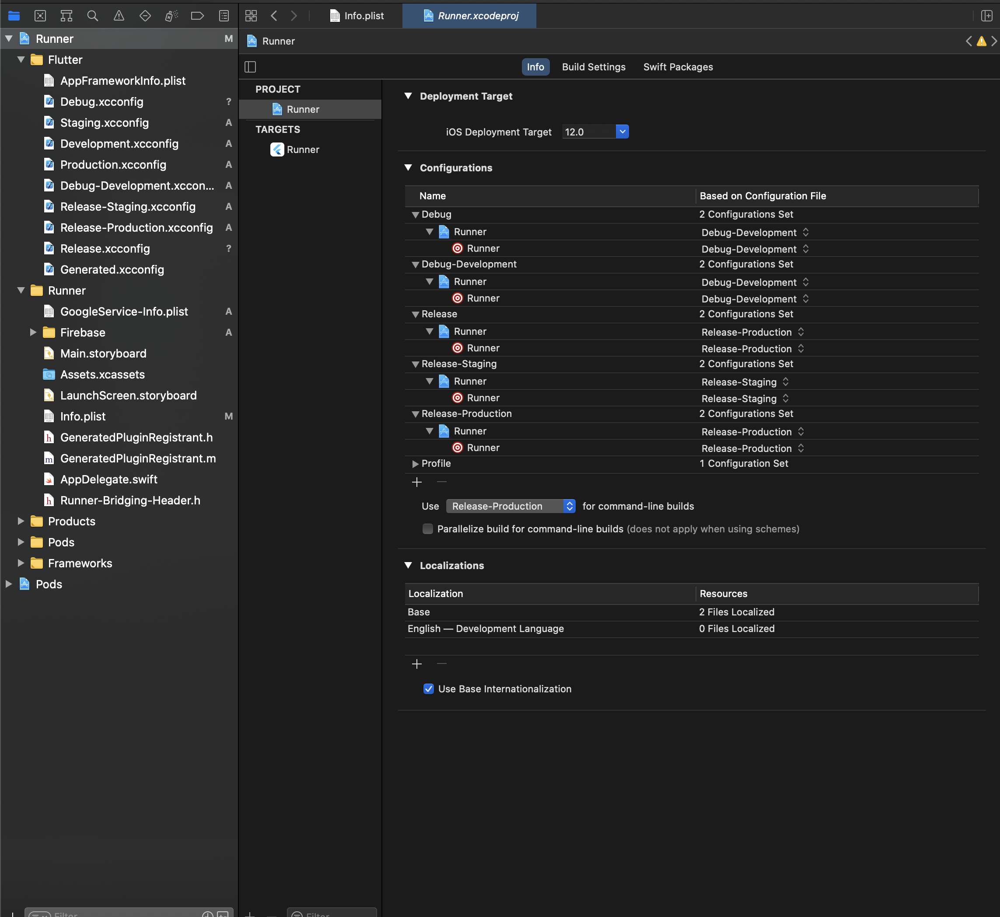
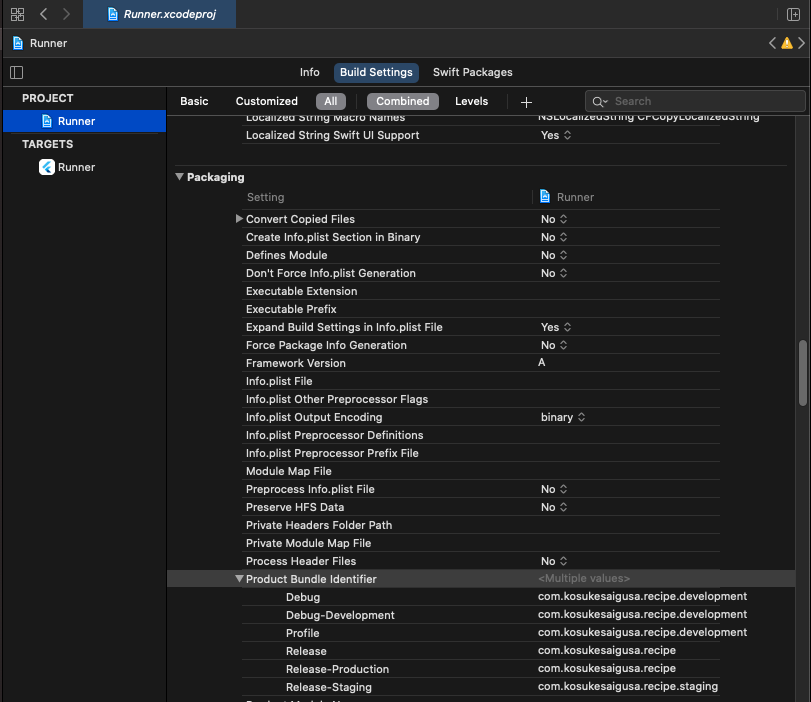
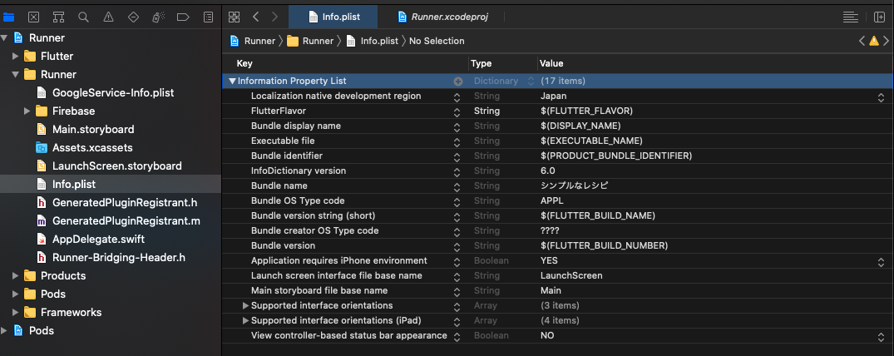
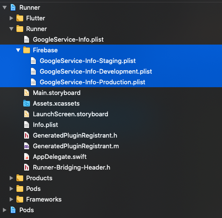
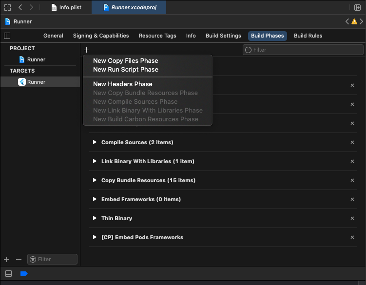
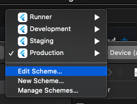
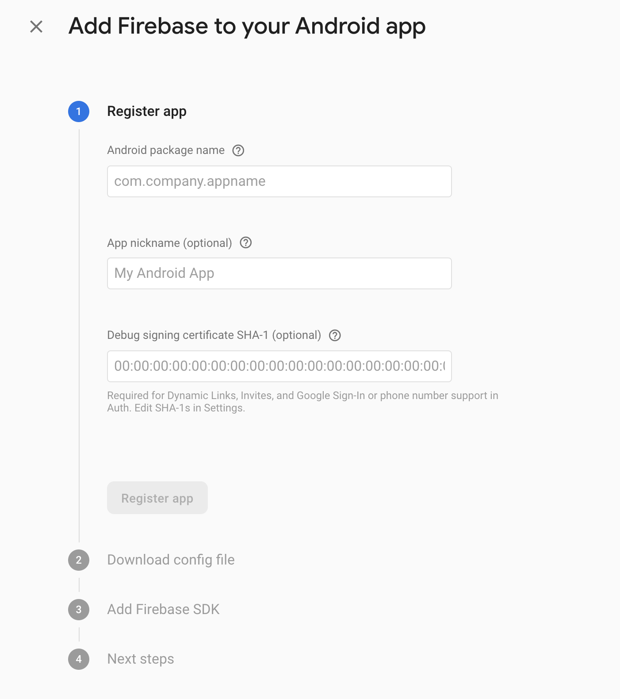

# 環境設定

## 環境ごとのビルド設定 (iOS)

ここでは、iOS でのビルドにおける、環境ごとのビルド設定の概要と設定方法をまとめます。

参考にしたのは下記のような情報です。

* [Medium mono さん：「Flutterで環境ごとにビルド設定を切り替える — iOS編」](https://medium.com/flutter-jp/flavor-b952f2d05b5d)
* [Github リポジトリ（上記 mono さんの記事に対応）](https://github.com/mono0926/flutter-flavor-example/blob/develop/ios/Runner/Info.plist)
* [Qiita 「flutterで本番/ステージング/開発を切り替える」](https://qiita.com/ko2ic/items/53f97bb7c28632268b5a)
* [Qiita 「FlutterでAndroidのリリース用APKをビルドする前の準備いろいろ」](https://qiita.com/kasa_le/items/d23075d817f42e869778)

環境のバリエーションは、開発環境、テスト環境、本番環境をそれぞれ、

* Development 環境
* Staging 環境
* Production 環境
と表現することとします。


今回はそれぞれの環境の種類、ビルドモード、Flavor、Configuration 名を合わせて、下表の3種類の設定を行います（より本格的には、開発中の実装のパフォーマンスを実機リリースモードで確かめるための Debug-Relase のような環境があっても良いでしょうが）。

| 種類 | ビルドモード | Flavor | Configuration 名 |
| ---- | ---- | ---- | ---- |
| 開発 | Debug | Development | Debug-Development |
| テスト | Release | Staging | Release-Staging |
| リリース | Release | Production | Release-Production |

また、それぞれの環境におけるアプリ名および Product Bundle Identifier は下記の通りです。

* Debug-Development 環境：Dev Recipe (com.kosukesaigusa.recipe.development)
* Release-Staging 環境：Staging Recipe (com.kosukesaigusa.recipe.staging)
* Release-Production 環境：シンプルなレシピ (com.kosukesaigusa.recipe)

Flutter の新規プロジェクトを作成したら、

```
open ios/Runner.xcworkspace
```

で Xcode を開きます。

Runner > PROJECT > Runner の iOS Deployment target は、サポートする iOS バージョンを開発するアプリのユーザーのシェアなどを考慮して適切に決めます。

次に、Xcode Menu > Product > Scheme > Manage Schemes

から、左下の「+」ボタンをクリックし、

* Target: Runner
* Name: Development

を入力して次へ進みます。同様に、Staging, Production についても Scheme を追加します。これらの Flavor バリエーションは、チームにも共有するので、「Shared」にもチェックをつけておき、下図のようになります。



次に、Configuration の追加を行います。初期状態では、Runner > PROJECT > Runner をクリックした画面の Configurations に、

* Debug
* Release
* Profile

だけが存在しているので、今回新たに定義する

* Debug-Development
* Release-Staging
* Release-Production

も追加する必要があります。

Runner > PROJECT > Runner をクリックした画面の Configurations の下部の「+」ボタンを押し、Debug-Development は既存の Debug から、Release-Staging と Release-Production は既存の Release から複製して設定します。

上の 3 つの Configurations が作成できたら、次の画像



のように、Runner > PROJECT > Runner > Configurations を設定して下さい。

この段階で、ターミナルで対象アプリの `ios` ディレクトリに移動して、

```
flutter run --debug --flavor development
```

コマンドを実行すると、とりあえずアプリの起動に成功するようになります。

しかし、ここまででは、まだ Flavor の違いがアプリケーションの振る舞いの違いに反映されません。そこで、以下のように、Configuration ごとの xcconfig ファイルを設定します。

Xcode で、Runner > Flutter 配下の、

* `Debug.xcconfig`
* `Release.xcconfig`
* `Profile.xcconfig` （場合によっては存在しないかも）

が元々存在している箇所で右クリックを押し、New File > Configuration Settings File を選択し、

* ファイル名: `Development.xcconfig`
* 保存場所：`recipe/ios/Flutter`
* Group: Flutter
* Target: Runner にチェック

のようにして、新たに Configuration ファイルを作成します。

* `Staging.xcconfig`
* `Production.xcconfig`
* `Debug-Development`
* `Release-Staging`
* `Release-Production`

についても同様にファイルを新規作成します。

各 Configuration ファイルの内容は、本プロジェクトの `ios/Flutter` 配下の[各ファイル](https://github.com/kboyflutteruniv/recipe-app/tree/main/ios/Flutter)のような内容にします。そこに実行環境ごとに別アプリ扱い、別アプリ名とするための設定に関わる内容 (`FLUTTER_FLAVOR`, `PRODUCT_BUNDLE_IDENTIFIER`, `DISPLAY_NAME`) が記述されています。

少し内容を補足すると、

* `FLUTTER_FLAVOR` は、ビルド時の Flavor 設定で、`development`, `staging,` `production` の三択
* `PRODUCT_BUNDLE_IDENTIFIER` は、別アプリとして区別するための情報で、`com.kosukesaigusa.recipe.development`, `com.kosukesaigusa.recipe.staging`, `com.kosukesaigusa.recipe` の三択
* `DISPLAY_NAME` は、別アプリとした扱うときのそれぞれのアプリ名

という感じです。

これを反映させるために、Xcode で Runner > PROJECT > Runner > Build Settings (All, Combined を選択) > Packaging > Product Bundle Identifier の値を、それぞれ

* Debug: `com.kosukesaigusa.recipe.development`
* Debug-Development: `com.kosukesaigusa.recipe.development`
* Release: `com.kosukesaigusa.recipe`
* Release-Production: `com.kosukesaigusa.recipe`
* Release-Staging: `com.kosukesaigusa.recipe.staging`

のように設定します。



同様の設定が、Runner > TARGETS の方にもあるので確認し、設定しましょう。

Runner > Runner > info.plist には、

```
<key>FlutterFlavor</key>
<string>$(FLUTTER_FLAVOR)</string>
<key>CFBundleDisplayName</key>
<string>$(DISPLAY_NAME)</string>
```

のペアを追加しておき、Bundle name はリリース版のアプリ名に相当する「シンプルなレシピ」としておきましょう。

```
<key>CFBundleName</key>
<string>シンプルなレシピ</string>
```



---

次に、Firebase を環境ごとに設定する方法をまとめます。

Firebase プロジェクトは、上記の3つの環境 (Development, Staging, Production) にそれぞれ1つずつ作成して準備します。今回は、下記のような名前で作成しました。

* dev-recipe-app（開発用）
* staging-recipe-app（テスト用）
* recipe-app（リリース用）

Project settings の Default GCP resource location は、東京に相当する `asia-northeast1` にしておきました。

「Add app」のボタンから iOS アプリを追加します。iOS bundle ID は、Development, Staging, Production に対して、それぞれ

* `com.kosukesaigusa.recipe.develop`
* `com.kosukesaigusa.recipe.staging`
* `com.kosukesaigusa.recipe`

とし、それぞれから得られる `GoogleService-Info.plist` は、

* `GoogleService-Info-Development.plist`
* `GoogleService-Info-Staging.plist`
* `GoogleService-Info-Production.plist`

と名前を変更しておきます。

これらの3つのファイルを、Xcode で新たに作成した Runner > Runnter > Firebase ディレクトリにドラッグ & ドロップで追加します（Finder などで追加すると、Xcode 側に認識されません）。



面倒なやり方ですが、ビルド時に、そのビルドモードに合わせて、`Runner/Runner/Firebase` ディレクトリの適当な `GoogleService-Info-XXX.plist` のファイルを選択し、それを `Runner/Runner` ディレクトリに上書きコピーすることで対応します。

そのような、ビルド時の特定のスクリプトの自動実行の設定は、Runner > Targets > Runner > Build Phases から行います。



この画面の上部の「+」ボタンで、New Run Script Phase を選択し、わかりやすさのために、スクリプト名をデフォルトの「Run Script」から任意に「Replace Google Service Info」などと書き換えておきます。

スクリプトの中身は下記のような内容です。

```
echo "--------------------"
echo "PRODUCT_NAME: ${PRODUCT_NAME}"
echo "CONFIGURATION: ${CONFIGURATION}"
echo "SRCROOT: ${SRCROOT}"
echo "PRODUCT_BUNDLE_IDENTIFIER: ${PRODUCT_BUNDLE_IDENTIFIER}"
echo "--------------------"

if [[ "${CONFIGURATION}" == "Debug-Development" ]]; then
    rm $PRODUCT_NAME/GoogleService-Info.plist
    cp $PRODUCT_NAME/Firebase/GoogleService-Info-Development.plist $PRODUCT_NAME/GoogleService-Info.plist
    echo "GoogleService-Info-Production.plist copied."
elif [[ "${CONFIGURATION}" == "Release-Staging" ]]; then
    rm $PRODUCT_NAME/GoogleService-Info.plist
    cp $PRODUCT_NAME/Firebase/GoogleService-Info-Staging.plist $PRODUCT_NAME/GoogleService-Info.plist
        echo "GoogleService-Info-Production.plist copied."
elif [[ "${CONFIGURATION}" == "Release-Production" ]]; then
    rm $PRODUCT_NAME/GoogleService-Info.plist
    cp $PRODUCT_NAME/Firebase/GoogleService-Info-Production.plist $PRODUCT_NAME/GoogleService-Info.plist
    echo "GoogleService-Info-Production.plist copied."
elif [[ "${CONFIGURATION}" == "Release" ]]; then
    rm $PRODUCT_NAME/GoogleService-Info.plist
    cp $PRODUCT_NAME/Firebase/GoogleService-Info-Production.plist $PRODUCT_NAME/GoogleService-Info.plist
    echo "GoogleService-Info-Production.plist copied."
else
    echo "configuration didn't match to Development, Staging or Production"
    echo $CONFIGURATION
    exit 1
fi
```

Output Files には、明示的に、`$SRCROOT/Runner/GoogleService-info.plist` と記載しておきます。

こうすることで、ビルドを行う度に、そのビルドモードに対応した `GoogleService-info.plist` が作成（置換）されることになります。

新たに作ったこの Run Script は、元々存在している Run script の下に Xcode 上でドラッグ & ドロップをして移動しておきました。

Android Studio で開発しながら、それぞれのビルドモードで実行するためには、画面上部、Simulator の選択ボックス右隣の Edit Configurations を追加します。


それぞれ

* Name: `Debug-Development`
* Name: `Release-Staging`
* Name: `Release-Production`

に対して、

Additional Arguments として、

* `--debug --flavor development --dart-define=FLAVOR=development`
* `--release --flavor staging --dart-define=FLAVOR=staging`
* `--release --flavor production --dart-define=FLAVOR=production`

Build Flavor として、

* `development`
* `staging`
* `production`

を記入しておきましょう。

また、Xcode側でも同様に、Edit Schemes から、それぞれのビルドモードに合わせた環境変数を設定します。



Development, Staging, Release のそれぞれのビルドモードに対して、Edit Scheme > Run から、

* Info > Build Configuration: `Debug-Development`, `Release-Staging`, `Release-Production` のうちの適切なもの
* Arguments > Environment Variables: `FLAVOR` という環境変数に対して `development`, `staging`, `production` のうちの適切なもの

を設定して下さい。

また、Release モードのビルド（Release-Staging と Release-Production）は、実機でしか実行できないことにも留意しておきましょう。

以上で、iOS における環境、Flavor の違いによる、別アプリ化、別の Firebase プロジェクトの参照の環境が構築されました。それぞれの環境で実行して、それらが正しく動作していることを確認して下さい。

---

## 環境ごとのビルド設定 (Android)

Android の方でも、同様の方法で Flavor (`development`, `staging`, or `production`) およびビルドモード (`debug` or `release`) とそれらに対応する異なる Firebase プロジェクトの設定ファイルに関する準備を行う必要があります。作業・編集はすべて、アプリケーションルート下の `android` ディレクトリ下で行います。

まず、`development`, `staging`, `production` のそれぞれの Firebase プロジェクトに Android の設定を追加します。Project Settings > Your apps に進んで「Add App」をクリックしましょう。



Android package name には、`development`, `staging`, `production` について、それぞれ

* com.kosukesaigusa.recipe.development
* com.kosukesaigusa.recipe.staging
* com.kosukesaigusa.recipe

のように記入します。

App nick name はユーザーに露出される内容ではありませんが、それぞれの環境だと分かる名前にしておくと良いでしょう。Debug signing certificate SHA-1 については、入力を省略しました。

そこで Register app をクリックすると、`google-services.json` という名前の設定ファイルがダウンロードできるようになります。

また、その後の Add Firebase SDK の指示に従って、プロジェクトレベルの `android/build.gradle` に必要な内容を書き加えます。

```
buildscript {
  repositories {
    // Check that you have the following line (if not, add it):
    google()  // Google's Maven repository
  }
  dependencies {
    ...
    // Add this line
    classpath 'com.google.gms:google-services:4.3.4'
  }
}

allprojects {
  ...
  repositories {
    // Check that you have the following line (if not, add it):
    google()  // Google's Maven repository
    ...
  }
}
```

さらに、アプリレベルの `android/app/build.gradle` にも必要な内容を書き加えます。

```
...

apply plugin: 'com.android.application'
apply plugin: 'kotlin-android'
apply from: "$flutterRoot/packages/flutter_tools/gradle/flutter.gradle"
apply plugin: 'com.google.gms.google-services'

...
```

`development`, `staging`, `production` のそれぞれの Firebase プロジェクトから得られた `google-service.json` ファイルは、名前の被りから末尾に余計な `(1)` のような名前が加わらないように注意して、それぞれ、

* `android/app/src/development`
* `android/app/src/staging`
* `android/app/src/production`

ディレクトリを新たに作成して、それらに格納します。

app レベルの `android/build.gradle` に必要な設定を行う前に、その前にアプリの証明書・署名情報に関連して必要な作業を行います。

コンソールで、デバッグ用、リリース用のそれぞれについて、

* `debug.jks`, `release.jks` のような `jks` ファイルの名前
* `debug_key`, `release_key` のようなエイリアス名

を必要な箇所で適宜置換して、

```
keytool -genkey -v -keystore {jks のファイル名} -alias {エイリアス名} -keyalg RSA -keysize 2048 -validity 10000
```

をターミナルに入力して実行します。

```
Enter keystore password:
Re-enter new password:
What is your first and last name?
  [Unknown]:  Kosuke Saigusa
What is the name of your organizational unit?
  [Unknown]:
What is the name of your organization?
  [Unknown]:  
What is the name of your City or Locality?
  [Unknown]:  Tokyo
What is the name of your State or Province?
  [Unknown]:  Tokyo
What is the two-letter country code for this unit?
  [Unknown]:  JP
Is CN=Aoi Makino, OU=Unknown, O=YouRegatta, L=Tokyo, ST=Tokyo, C=JP correct?
  [no]:  yes

Generating 2,048 bit RSA key pair and self-signed certificate (SHA256withRSA) with a validity of 10,000 days
	for: CN=Aoi Makino, OU=Unknown, O=YouRegatta, L=Tokyo, ST=Tokyo, C=JP
```

上のようなやり取りで各種設定を行います。特に、

* キーエイリアスの名前
* キーストアのパスワード
* キーエイリアスの鍵パスワード（キーストアのパスワードと同様ならそれ）

については、この後の作業で使うので、その他の情報と共に大切に控えておきましょう。

ここで生成された `debug.jks`, `release.jks` のような 2 つの `jks` ファイルは、`android/app` 下に移動します。また、これらのファイルは秘匿情報に相当するので、パブリックリポジトリを使っているときなどは、Git 管理の対象から忘れずに外しておきましょう。

次に、`android/` 下に、それぞれに debug, release のそれぞれに対応する署名情報ファイルを作成します。それぞれ

* `android/debug_key.properties`
* `android/release_key.properties`

としておきました。

それぞれの内容は下記の通りです。

```
storePassword=ストアパスワード
keyPassword=キーパスワード
keyAlias=キーエイリアスの名前
storeFile=./debug.jks または ./release.jks の対応する方
```

これらもパブリックリポジトリを使っているときなどは、Git 管理の対象から外しておきます。

いよいよ app レベルの `android/build.gradle` に必要な設定を行っていきます。

まず、`android {...}` の前に、上で作成した 2 つの `properties` ファイルを定義しておきます。

```
...

apply plugin: 'com.android.application'
apply plugin: 'kotlin-android'
apply from: "$flutterRoot/packages/flutter_tools/gradle/flutter.gradle"
apply plugin: 'com.google.gms.google-services'

// 下記の 2 行を追加
def debugKeystorePropertiesFile = rootProject.file("debug_key.properties")
def releaseKeystorePropertiesFile = rootProject.file("release_key.properties")

android {
    ...
}

...

```

さらに、[/android/app/build.gradle](https://github.com/KosukeSaigusa/recipe-app/blob/main/android/app/build.gradle) を参考に、`defaultConfig {...}`, `SigningConfig {...}`, `buildTypes {...}`, `flavorDimension`, `productFlavors {...}` などを `android {...}` の中に加筆・編集していきます。

```
...

android {
    ...

    defaultConfig {
        applicationId "com.kosukesaigusa.recipe" // 元となる package name
        minSdkVersion 16
        targetSdkVersion 29
        versionCode flutterVersionCode.toInteger()
        versionName flutterVersionName
        multiDexEnabled true
    }

    signingConfigs {
        debug {
            if (debugKeystorePropertiesFile.exists()) {
                def debugKeystoreProperties = new Properties()
                debugKeystoreProperties.load(new FileInputStream(debugKeystorePropertiesFile))
                keyAlias debugKeystoreProperties['keyAlias']
                keyPassword debugKeystoreProperties['keyPassword']
                storeFile file(debugKeystoreProperties['storeFile'])
                storePassword debugKeystoreProperties['storePassword']
            }
        }
        release {
            if (releaseKeystorePropertiesFile.exists()) {
                def releaseKeystoreProperties = new Properties()
                releaseKeystoreProperties.load(new FileInputStream(releaseKeystorePropertiesFile))
                keyAlias releaseKeystoreProperties['keyAlias']
                keyPassword releaseKeystoreProperties['keyPassword']
                storeFile file(releaseKeystoreProperties['storeFile'])
                storePassword releaseKeystoreProperties['storePassword']
            }
        }
    }

    buildTypes {
        debug {
            debuggable true
            signingConfig signingConfigs.debug
        }
        release {
            signingConfig signingConfigs.release
        }
    }

    productFlavors {
        development {
            dimension "app"
            resValue "string", "app_name", "develop 環境のアプリ名"
            applicationIdSuffix ".development"
        }
        staging {
            dimension "app"
            resValue "string", "app_name", "staging 環境のアプリ名"
            applicationIdSuffix ".staging"
        }
        production {
            dimension "app"
            resValue "string", "app_name", "production 環境のアプリ名"
        }
    }

}

...
```

最後に、`android/app/src/main/AndroidManifest.xml` ファイルを加筆・修正します。

まず、冒頭の

```
<manifest xmlns:android="http://schemas.android.com/apk/res/android" package="com.kosukesaigusa.recipe">
```

の部分に、自身のアプリの package name が正しく記載されていることを確認します。

次に

```
<application
    android:name="io.flutter.app.FlutterApplication"
    android:label="@string/app_name"
    android:icon="@mipmap/ic_launcher">
```

の `android:label="XXXXX"` の部分を上記のように書き換えます。

その他、たとえば Image Cropper の外部ライブラリを使用している場合には、その指示に従って、`<application></application>` の中に、

```
<activity
    android:name="com.yalantis.ucrop.UCropActivity"
    android:screenOrientation="portrait"
    android:theme="@style/Theme.AppCompat.Light.NoActionBar"/>
```

のような内容を書き加える必要がある場合があります。